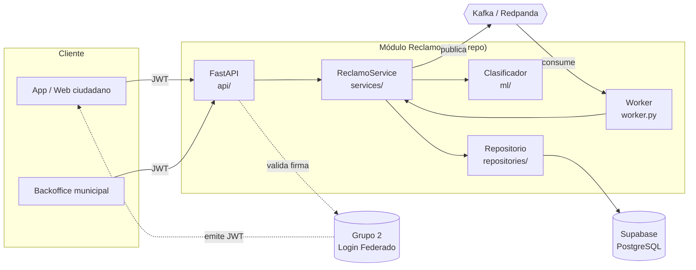
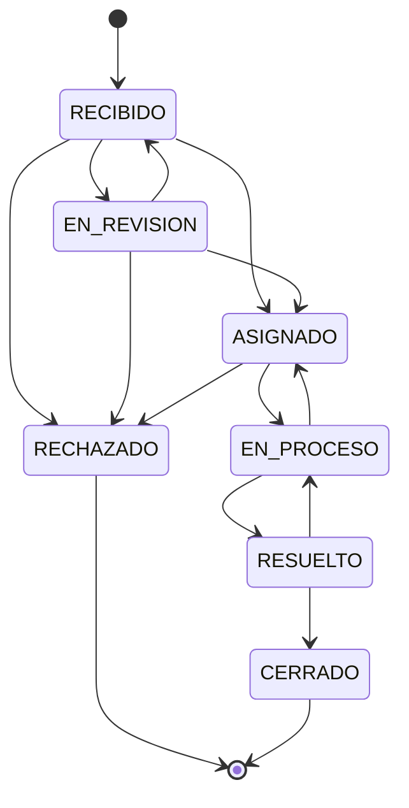

# CityPass+ · Reclamos y Participación Ciudadana

Backend del **Grupo 5** de la plataforma CityPass+ (UADE · Desarrollo de Aplicaciones II · 2026 2C).

Gestiona el ciclo de vida completo de un reclamo vecinal: alta, **clasificación
automática** por categoría y prioridad, seguimiento con trazabilidad de estados,
comentarios, adhesiones de otros vecinos, y publicación/consumo de eventos en el
bus de la ciudad.

| | |
| --- | --- |
| **Stack** | Python 3.12 · FastAPI · SQLAlchemy 2 async · Alembic · Kafka (Redpanda) · Supabase |
| **Docs API** | `http://localhost:8000/docs` |
| **Convenciones** | [`CLAUDE.md`](CLAUDE.md) |
| **Decisiones** | [`docs/adr/`](docs/adr/) |
| **Contratos de eventos** | [`docs/eventos.md`](docs/eventos.md) |

---

## Arquitectura



**Reglas de capa** (detalle en `CLAUDE.md`): las dependencias apuntan hacia
adentro, el servicio depende del puerto `EventPublisher` y no de Kafka, y el
repositorio nunca commitea — la unidad de trabajo la maneja el servicio.

---

## Puesta en marcha

```bash
# 1. Entorno
python -m venv .venv
.venv\Scripts\activate           # Linux/Mac: source .venv/bin/activate
pip install -e ".[dev]"

# 2. Configuración
copy .env.example .env           # y completar DATABASE_URL + JWT_SECRET

# 3. Infraestructura local (Redpanda + consola web + Postgres)
docker compose up -d redpanda redpanda-init redpanda-console postgres

# 4. Base de datos
alembic upgrade head

# 5. Servicios
uvicorn app.main:app --reload    # API      -> http://localhost:8000/docs
python -m app.worker             # consumer de eventos
```

Todo junto en contenedores:

```bash
docker compose up --build
```

| Servicio | URL |
| --- | --- |
| API | http://localhost:8000/docs |
| Consola del bus | http://localhost:8080 |
| Postgres local | `localhost:5432` (`citypass` / `citypass`) |

### Conectar a Supabase

En *Project Settings → Database → Connection string → URI*. Pegar la URI tal
cual en `DATABASE_URL`: el servicio la reescribe al driver async y resuelve solo
el SSL y el pooler.

- **Migraciones** → session pooler (puerto `5432`).
- **API** → transaction pooler (puerto `6543`); el código desactiva el cache de
  prepared statements al detectar ese puerto.

---

## Autenticación

Los tokens los emite el módulo de **Login Federado (Grupo 2)**. Este servicio
solo los valida: soporta HS256 con secreto compartido y RS256 contra el JWKS del
emisor. Todos los endpoints excepto `/health*` exigen `Authorization: Bearer`.

| Rol | Permisos |
| --- | --- |
| `ciudadano` | Crear reclamos, comentar, adherir, consultar |
| `operador` | Todo lo anterior + cambiar estados y asignar |
| `admin` | Todo lo anterior + ver las métricas agregadas |

Las métricas son información de gestión: un operador trabaja la bandeja pero
**no** accede a `/reclamos/estadisticas`.

### Login de desarrollo (Entrega 1)

Mientras el servicio de identidad no esté disponible, con
`AUTH_DEV_LOGIN_ENABLED=true` se monta un login con usuarios fijos que devuelve
un JWT del mismo formato que va a emitir el Grupo 2:

```bash
curl -X POST http://localhost:8000/api/v1/auth/dev/login   -H "Content-Type: application/json"   -d '{"usuario":"vecino1","password":"vecino1"}'
```

| Usuario | Contraseña | Roles |
| --- | --- | --- |
| `vecino1` | `vecino1` | `ciudadano` |
| `operador1` | `operador1` | `operador` |
| `admin1` | `admin1` | `operador`, `admin` |

Es andamiaje temporal y no puede encenderse fuera de un entorno de desarrollo:
detalle y criterio de eliminación en [`CLAUDE.md`](CLAUDE.md#9-integración-con-los-otros-grupos).
Para scripts y pruebas manuales sigue estando el generador de tokens:

```bash
python scripts/dev_token.py --sub vecino-1 --roles ciudadano
python scripts/dev_token.py --sub operador-1 --roles operador
```

---

## API

Prefijo `/api/v1`.

| Método | Ruta | Rol | Qué hace |
| --- | --- | --- | --- |
| `POST` | `/reclamos` | ciudadano | Alta. Clasifica solo si no mandan categoría/prioridad. |
| `GET` | `/reclamos` | autenticado | Listado paginado con filtros y búsqueda de texto. |
| `GET` | `/reclamos/{id}` | autenticado | Detalle con historial y comentarios. |
| `PATCH` | `/reclamos/{id}/estado` | operador | Cambia estado validando la máquina de estados. |
| `POST` | `/reclamos/{id}/comentarios` | autenticado | Comenta (marcado oficial si es staff). |
| `GET` | `/reclamos/{id}/comentarios` | autenticado | Lista comentarios. |
| `GET` | `/reclamos/{id}/historial` | autenticado | Trazabilidad de estados. |
| `POST` | `/reclamos/{id}/adhesiones` | ciudadano | "A mí también me pasa". |
| `POST` | `/reclamos/clasificacion` | autenticado | Sugerencia del modelo sin persistir. |
| `GET` | `/reclamos/estadisticas` | **admin** | Métricas agregadas (para el Grupo 8). |
| `POST` | `/auth/dev/login` | público | Login de desarrollo. Solo con `AUTH_DEV_LOGIN_ENABLED=true`. |
| `GET` | `/auth/dev/usuarios` | público | Usuarios de prueba disponibles, sin contraseñas. |
| `GET` | `/health`, `/health/ready` | público | Liveness y readiness. |

Los errores siguen **RFC 7807**:

```json
{
  "type": "https://citypass.local/errors/transicion_invalida",
  "title": "Transicion de estado invalida",
  "status": 409,
  "detail": "No se puede pasar de RESUELTO a ASIGNADO",
  "instance": "/api/v1/reclamos/6f1c.../estado"
}
```

### Máquina de estados



Toda transición fuera de este diagrama devuelve `409 transicion_invalida`.

---

## Eventos

**Publicamos** (key = id del reclamo, para conservar el orden por agregado):

`reclamos.reclamo.creado` · `reclamos.reclamo.clasificado` ·
`reclamos.reclamo.estado-cambiado` · `reclamos.reclamo.resuelto` ·
`reclamos.reclamo.adherido`

**Consumimos:**

| Topic | Reacción |
| --- | --- |
| `residuos.contenedor.desbordado` | Alta automática de un reclamo de RESIDUOS. |
| `emergencias.incidente.creado` | Sube la prioridad de los reclamos abiertos del barrio. |

Garantías: *at-least-once* con commit manual del offset, idempotencia por
`evento_origen_id` (UNIQUE en base) y DLQ (`reclamos.dlq`) para los mensajes que
no se pueden procesar. Payloads y ejemplos completos en
[`docs/eventos.md`](docs/eventos.md).

---

## Clasificación automática (IA/ML)

Diseño híbrido, deliberado:

- **Categoría** → Naive Bayes multinomial entrenado con el corpus semilla de
  `app/ml/corpus.py` (unigramas + bigramas, sin tildes, sin stopwords).
- **Prioridad** → regla explícita: léxico de urgencia (`fuga de gas`, `cable
  caído`, `riesgo`…) sobre una criticidad base por categoría. Es una decisión de
  política pública, tiene que ser auditable, no salir de un modelo opaco.

Cada sugerencia devuelve `confianza` y `evidencia` (los términos que la
dispararon). Si la confianza queda por debajo de `CONFIANZA_MINIMA_CLASIFICADOR`,
el reclamo entra en `EN_REVISION` para triage humano en lugar de caer en la
bandeja del área equivocada.

Para mejorarlo: agregar filas a `app/ml/corpus.py` (los reclamos que un operador
reclasificó a mano son los ejemplos más valiosos) o implementar el protocolo
`Clasificador` con otro modelo y cambiar `get_clasificador()`. Ver
[ADR 0005](docs/adr/0005-clasificacion-automatica.md).

---

## Tests y calidad

```bash
pytest                  # 90 tests, cobertura ~90% (mínimo exigido: 60%)
ruff check . --fix
ruff format .
```

La suite corre sobre SQLite en memoria: no necesita Postgres, Supabase ni
broker. El CI (`.github/workflows/ci.yml`) además aplica y revierte las
migraciones contra un PostgreSQL real y construye la imagen Docker.

---

## Estructura

```
app/
├── api/          routers v1, dependencias, manejo de errores RFC 7807
├── services/     casos de uso (ReclamoService) y clasificador
├── repositories/ queries SQLAlchemy
├── db/           engine, sesión y modelos ORM
├── domain/       enums, máquina de estados, reglas puras
├── events/       topics, contratos, producer, consumer, handlers
├── ml/           preprocesamiento de texto, Naive Bayes, corpus
├── schemas/      DTOs Pydantic
├── core/         config, logging, seguridad, excepciones
├── main.py       app FastAPI
└── worker.py     proceso consumidor
alembic/          migraciones
tests/            unit + integration
docs/             ADRs y contratos de eventos
```

---

## Equipo

Grupo 5 — Reclamos y Participación Ciudadana. Convenciones de trabajo, flujo de
git y checklist de PR en [`CLAUDE.md`](CLAUDE.md).
