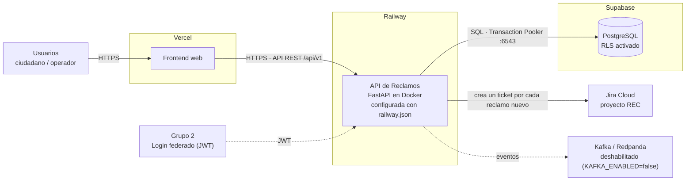
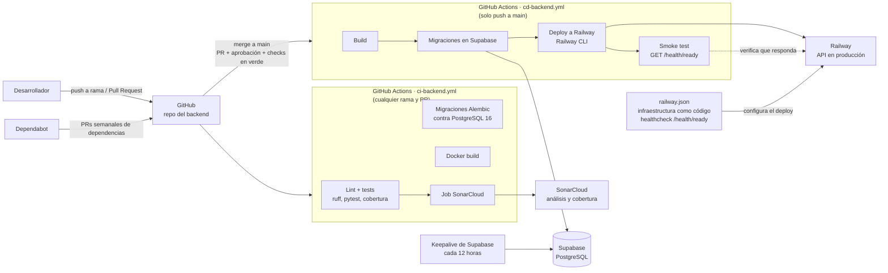

# Diagrama de despliegue — Backend de Reclamos (Grupo 5)

Este documento describe dónde corre cada parte del sistema y cómo llega el código
a producción. Los diagramas están en Mermaid, así que GitHub los dibuja directo.

## 1. Arquitectura de despliegue

**Referencias**

- Las flechas punteadas son integraciones opcionales o todavía no activas: Kafka
  está apagado en producción, y el login del Grupo 2 convive con el login de prueba
  (`/api/v1/auth/dev/login`) durante la Entrega 1.
- La integración con Jira se activa con `JIRA_ENABLED=true` y necesita
  `JIRA_URL`, `JIRA_EMAIL` y `JIRA_API_TOKEN`.
- Toda la configuración sensible vive en variables de entorno de Railway, no en el
  repositorio.
- La configuración de despliegue de Railway está versionada en el repositorio
  (`railway.json`, infraestructura como código), con un healthcheck en
  `/health/ready`: Railway solo le pasa el tráfico a un deploy nuevo cuando ese
  endpoint responde bien, y si sale roto sigue atendiendo la versión anterior.

## 2. Pipeline de CI/CD

**Referencias**

- La rama `main` está protegida: nadie sube directo, hace falta un Pull Request
  aprobado y los checks `Lint + tests` y `Alembic against PostgreSQL` en verde.
- El CD aplica las migraciones en Supabase **antes** de desplegar en Railway, y si
  el smoke test no recibe respuesta de `/health/ready`, el run queda en rojo.
- El workflow de keepalive consulta la base cada 12 horas para que el plan gratuito
  de Supabase no la pause.